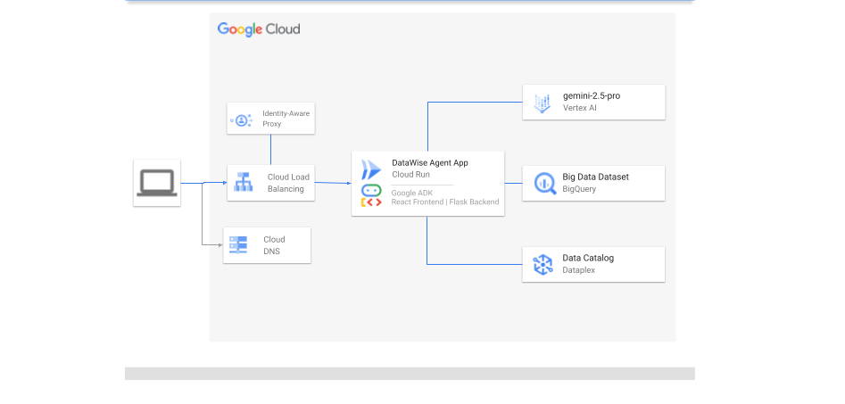

# Retail Big Data Agent

This project is a data agent application with a React frontend and a Python backend. The agent leverages custom tools to interact with data and provide insights.

## How it Works

This project is designed to provide a user interface for interacting with a data agent. The backend (`backend/app.py`) dynamically determines the location of the React frontend build files based on the environment.

*   **Frontend:** Developed with React and Vite, the frontend provides a user interface for interacting with the data agent. It features components for chat interface, data preview, horizontal and vertical navigation, and solution architecture. The frontend communicates with the backend through API calls. Key components include `App.js` for the main application and various components in the `frontend/src/components` directory.
*   **Backend:** The backend is a Python application that serves as the data agent. It exposes API endpoints that the frontend interacts with. The backend's primary function is to process user requests, interact with data sources, and provide responses. The agent logic is implemented in `data_agent/agent.py`.
*   **Agentic Architecture:** The core intelligence resides in the agent implemented in `data_agent/agent.py`. This agent is designed to understand natural language queries from the user and determine the appropriate actions to take. The agent is equipped with a set of custom tools defined in `data_agent/custom_tools.py`.
*   **Tools and Function Calling:** The agent's capabilities are extended through the use of custom tools (implemented as Python functions in `data_agent/custom_tools.py`). These tools simulate interactions with various external systems or data sources. Examples of implemented tools include:
    *   (Add specific tool descriptions here based on `data_agent/custom_tools.py`)
    This architecture demonstrates how agents can be augmented with external capabilities to create more powerful and useful applications.

## Common Prerequisites 

* **Python 3.12.9**: The agent has been tested with Python 3.12.9
* **Google Cloud SDK (`gcloud`)**: Required for authenticating with Google Cloud services. Install it from [here](https://cloud.google.com/sdk/docs/install).
* **Google Cloud Account & Project**: You need a Google Cloud account and a project with the BigQuery, Dataplex API enabled.
* **Google Generative AI API Key**: You need an API key to use Gemini. Get one from [Google AI Studio](https://aistudio.google.com/app/apikey).
* **Authenticate with Google Cloud**:
    This step configures Application Default Credentials (ADC), which the BigQuery Python client library uses to authenticate API requests.
    ```bash
    gcloud auth application-default login
    ```
    Follow the prompts to log in with your Google account.

* **Set Environment Variables**:
    Configure the necessary environment variables for the agent.
    * **`GOOGLE_API_KEY`**: Your API key obtained from Google AI Studio.
    * **`GOOGLE_GENAI_USE_VERTEXAI`**: Set to `0` to use the standard Gemini API (via AI Studio) or `1` to use Vertex AI. The setup commands indicate you are using the standard API.

    ```bash
    export GOOGLE_API_KEY='YOUR_API_KEY_HERE'
    export GOOGLE_GENAI_USE_VERTEXAI=0
    ```
    **Important**: Replace `'YOUR_API_KEY_HERE'` with your actual API key. Do not commit your API key directly into your code or version control. Consider using a `.env` file and a library like `python-dotenv` for better key management.

* **Set Constants**:
    In `data_agent/constants.py`, set appropriate values for constants:
    * **`PROJECT_ID`**: The Google Cloud Project ID that contains the BigQuery datasets and tables to be analyzed. (e.g., "my-gcp-project-123")
    * **`LOCATION`**: The geographical location of the BigQuery datasets and tables to be analyzed (e.g., "US", "asia-northeast3")
    * **`MODEL`**: Identifier for the specific generative model to be used by the agent. (e.g., "gemini-2.5-pro-preview-03-25")
    * **`TABLE_NAMES`**: Optional list of specific table names within DATASET_NAME. If empty, operations might apply to all tables in the dataset. (e.g., ["orders", "customers"] or [])
    * **`DATA_PROFILES_TABLE_FULL_ID`**: Optional. Full BigQuery table ID where data profiling results are stored. Set to None or an empty string if not used. (e.g., "my_project.profiling_dataset.all_profiles", None, "")

    ```python
    MODEL="gemini-2.5-pro-preview-03-25"
    PROJECT_ID=""
    LOCATION=""
    DATASET_NAME=""
    TABLE_NAME=""
    DATA_PROFILES_TABLE_FULL_ID=""
    ```
* **Metadata Enrichment**:
    To enhance the agent's understanding and grounding capabilities, it is highly recommended to enrich your BigQuery metadata:

    * **Add Descriptions**: Provide clear descriptions for your BigQuery tables and columns.

    * **Run Data Profile Scans**: Execute [data profile scans](https://cloud.google.com/dataplex/docs/data-profiling-overview) on the tables you intend to analyze. Ensure the results are exported and stored in a BigQuery table by enabling the "Export to BigQuery" option.

    * **Utilize Dataplex Aspects**: Leverage [Dataplex Aspects](https://cloud.google.com/dataplex/docs/enrich-entries-metadata) to add technical and business metadata to your tables. The agent is designed to ground itself on all Aspect information associated with the tables.

## Minimal Local Setup

For a quick start and testing the core agent functionality with a minimalistic UI, follow these steps:

1.  **Install Python Dependencies:**
    *   Ensure you have Python installed 
    *   Create and activate a virtual environment (optional but recommended):
        ```bash
        python3 -m venv venv
        source venv/bin/activate  # On Linux/macOS
        # venv\Scripts\activate  # On Windows
        ```
    *   Install the required Python packages, including the `google-adk`:
        ```bash
        pip install -r requirements.txt
        ```
2.  **Run the ADK Web UI:**
    *   With the virtual environment activated (if used), run the following command from the project root directory:
        ```bash
        adk web
        ```
    *   This will start a minimalistic web interface provided by the `google-adk` for interacting with the agent. Open the provided URL in your web browser.

1.  **Install Python Dependencies:**
    *   Ensure you have Python installed 
    *   Create and activate a virtual environment (optional but recommended):
        ```bash
        python3 -m venv venv
        source venv/bin/activate  # On Linux/macOS
        # venv\Scripts\activate  # On Windows
        ```
    *   Install the required Python packages, including the `google-adk`:
        ```bash
        pip install -r requirements.txt
        ```
2.  **Run the ADK Web UI:**
    *   With the virtual environment activated (if used), run the following command from the project root directory:
        ```bash
        adk web
        ```
    *   This will start a minimalistic web interface provided by the `google-adk` for interacting with the agent. Open the provided URL in your web browser.

## Full-stack Local Setup

To run the complete application with the React frontend and Python backend, follow these steps:

### Prerequisites

Before you begin, ensure you have the following installed:

*   **Python:** The agent has been tested with Python 3.12.9
*   **Node.js & npm:** The agent has been tested with Node.js v23.11.0
*   **Git:** For cloning the repository.
*   **Google Cloud SDK:** Ensure `gcloud` is installed and authenticated (`gcloud auth login`).
*   **Permissions:** Your authenticated user or service account needs permissions to use Cloud Build, Artifact Registry, and Cloud Run within your GCP project.
*   **APIs Enabled:** Ensure the Cloud Build API, Artifact Registry API, and Cloud Run Admin API are enabled in your GCP project.
*   **Artifact Registry Repository:** Ensure the Artifact Registry repository specified in `scripts/deploy.sh`  exists in your project.

### Project Setup

1.  **Clone the Repository:**
    ```bash
    git clone <your-repository-url>
    cd data-agent
    ```
2.  **Backend Setup (Python):**
    *   **Create and Activate Virtual Environment:**
        ```bash
        python3 -m venv venv
        source venv/bin/activate  # On Linux/macOS
        # venv\Scripts\activate  # On Windows
        ```
    *   **Install Python Dependencies:**
        ```bash
        pip install -r requirements.txt
        ```
3.  **Frontend Setup (React):**
    *   **Navigate to Frontend Directory:**
        ```bash
        cd frontend
        ```
    *   **Install Node.js Dependencies:**
        ```bash
        npm install
        ```
    *   **Navigate Back to Root:**
        ```bash
        cd ..
        ```

### Running the Application

The frontend and backend are integrated into a single server, simplifying the deployment and development process.

To run the entire application (both frontend and backend), you only need to execute a single command from the project root directory:

*   run the following command from the project root directory:
    ```bash
    cd frontend && npm run build && cd .. && bash entrypoint.sh
    ```

*   The server should now be running, typically on `http://localhost:8080`.
*   Open the frontend URL in your web browser to use the application.

## Deploy

The project is configured for deployment to Google Cloud Run using Docker and Cloud Build.

### How Deployment Works

The deployment process is orchestrated by the `scripts/deploy.sh` script. This script performs the following key steps:

1.  **Configuration:** Reads project-specific variables, including the Google Cloud Project ID, from `scripts/init.sh`.
2.  **Build Trigger:** Submits a build request to Google Cloud Build using the `cloudbuild.yaml` configuration file.
3.  **Docker Image Build:** Cloud Build uses the `Dockerfile` to build a container image. The `Dockerfile` defines the environment and dependencies for the application, including building the React frontend and setting up the Python backend.
4.  **Image Push:** Upon successful build, Cloud Build pushes the resulting Docker image to Google Artifact Registry.
5.  **Cloud Run Deployment:** The `scripts/deploy.sh` script then deploys the newly built image from Artifact Registry to the specified Google Cloud Run service.

### Prerequisites

Before deploying, ensure you have the following:

1.  **Google Cloud SDK:** Ensure `gcloud` is installed and authenticated (`gcloud auth login`).
2.  **Required APIs Enabled:** Ensure the following APIs are enabled in your GCP project:
    *   Cloud Build API
    *   Artifact Registry API
    *   Cloud Run Admin API
3.  **Required IAM Permissions:** Your authenticated user or service account needs permissions to:
    *   Submit builds to Cloud Build.
    *   Push and pull images from Artifact Registry.
    *   Deploy services to Cloud Run.
    *   A common approach is to grant roles like `Cloud Build Editor`, `Artifact Registry Administrator`, and `Cloud Run Developer` or more granular permissions as per your organization's security policies.
4.  **Artifact Registry Repository:** Ensure the Artifact Registry repository specified in `scripts/deploy.sh`  exists in your project. Create it if it doesn't:
    ```bash
    gcloud artifacts repositories create <AR Repo Name> \
        --repository-format=docker \
        --location=us-central1 \
        --description="Docker repository for Data Agent"
    ```

### Using the Deployment Script (`scripts/deploy.sh`)

This script automates the process of building the Docker image using Cloud Build and deploying it to the appropriate Cloud Run service.

**Steps:**

1.  **Configure Project ID:**
    *   Edit the `scripts/init.sh` file.
    *   Set the `PROJECT_ID` variable to your actual Google Cloud Project ID.
        ```bash
        # scripts/init.sh
        # Your project name. It acts as a unique identifier.
        export PROJECT_NAME= # Optional, can be changed
        # Your GCP Project ID
        export PROJECT_ID=your-gcp-project-id-here # <-- UPDATE THIS LINE
        ```

2.  **Run the Deployment Script:**
    *   Navigate to the project root directory (`data-agent`).
    *   Make the script executable (if needed): `chmod +x scripts/deploy.sh`
    *   Execute the script, providing either `app` (for the Flask backend) as an argument:
        ```bash
        # To deploy the Flask backend service:
        ./scripts/deploy.sh app
        ```
    * The script will:
        *   Source the `PROJECT_ID` from `init.sh`.
        *   Submit a build to Google Cloud Build using `cloudbuild.yaml`.
        *   Deploy the built image from Artifact Registry to the corresponding Cloud Run service .
        *   Output the URL of the deployed service upon success.

You will need appropriate GCP permissions and configuration (Project ID, Artifact Registry).

## Project Structure

```
.
├── .dockerignore      # Files ignored by Docker build
├── .gcloudignore      # Files ignored by gcloud commands
├── .gitignore         # Files ignored by Git
├── backend/           # Python backend code
│   ├── app.py           # Main application file
│   ├── utils.py         # Utility functions
│   └── __init__.py
├── data_agent/        # Agent related code
│   ├── agent.py         # Agent implementation
│   ├── constants.py     # Constants
│   ├── custom_tools.py  # Custom tools for the agent
│   ├── instructions.py  # Instructions for the agent
│   └── __init__.py
├── frontend/          # React frontend application
│   ├── public/          # Static assets
│   ├── src/             # Source code
│   │   ├── App.css        # Main application CSS
│   │   ├── App.js         # Main application component
│   │   ├── components/    # React components
│   │   ├── index.css      # Index CSS
│   │   ├── index.js       # Index JS
│   │   └── reportWebVitals.js # Web vitals reporting
│   ├── package.json     # Node.js dependencies and scripts
│   └── vite.config.js   # Vite configuration
├── scripts/           # Scripts
│   ├── deploy.sh      # Deployment script
│   └── init.sh        # Initialization script
├── Dockerfile         # Docker configuration
├── entrypoint.sh      # Entrypoint script
├── README.md          # This file
└── requirements.txt   # Python dependencies
```


The Flask backend dynamically determines the location of the React frontend build files based on the environment:

*   **Docker:** Inside a Docker container, the backend expects the build files to be located at `/app/frontend_build`. This is because the `Dockerfile` copies the built frontend files to this location.
*   **Local Development:** When running locally, the backend expects the build files to be located in the `frontend/dist` directory within the project.

This logic is implemented in the `create_app` function within `backend/app.py`.

```python
    react_build_dir_config = None # Initialize config variable
    if app_env == 'docker':
        # Inside Docker, use the absolute path where Dockerfile copies the build files
        react_build_path = '/app/frontend_build'
        print(f"Docker mode: Determined build directory as: {react_build_path}")
    else:
        # Locally, point to the actual build output directory in the source tree
        react_build_path = os.path.abspath(os.path.join(os.path.dirname(__file__), '..', 'frontend', 'dist'))
        print(f"Local mode: Determined build directory as: {react_build_path}")

## Solution Architecture

### Overview

The Data Agent application employs a modern, modular architecture designed for scalability, maintainability, and a seamless user experience. It consists of three primary layers: a dynamic frontend, a robust backend API, and an intelligent agentic core. This separation of concerns allows for independent development and scaling of each component.

### Frontend

The user interface is a single-page application (SPA) built to provide an interactive and responsive experience for users querying the data agent.

*   **Technology Choices:**
    *   **React:** Chosen for its component-based architecture, which promotes code reusability and maintainability. Its virtual DOM ensures efficient UI updates, leading to a smooth user experience. The large community and ecosystem provide ample resources and libraries.
    *   **Vite:** Selected as the build tool and development server due to its extremely fast cold server start and Hot Module Replacement (HMR), significantly improving developer productivity. It produces optimized production builds.
    *   **JavaScript & CSS:** Standard web technologies for building interactive UIs and styling components.
*   **Purpose:**
    *   Provides the primary user interaction point via a chat interface.
    *   Renders data previews and potentially visualizations based on agent responses.
    *   Includes navigation and structural elements for easy access to different application features.
*   **Key Features:**
    *   **Chat Interface:** Enables users to submit natural language queries to the agent and view the conversation history.
    *   **Data Preview:** Displays structured data returned by the agent, potentially sourced from BigQuery.
    *   **Architecture Overview:** Presents information about the application's design (this section).

### Backend

The backend serves as the API layer and orchestration engine, handling communication between the frontend and the agentic core.

*   **Technology Choices:**
    *   **Python:** Selected for its extensive libraries and frameworks suitable for backend development, data manipulation, and AI/ML tasks. Its readability and large community support make it ideal for building the agent and its tools.
    *   **Flask:** A lightweight and flexible micro-framework for Python, chosen for its simplicity in building the API endpoints required by the frontend. It allows for easy integration with the agentic core and other Python libraries.
*   **Purpose:**
    *   Exposes RESTful API endpoints for the frontend to consume.
    *   Authenticates and authorizes user requests.
    *   Receives queries from the frontend and passes them to the agentic core.
    *   Relays the agent's responses back to the frontend.
    *   Manages application state and configuration.

### Agentic Core

This is the brain of the application, responsible for understanding user intent, interacting with data sources, and generating responses.

*   **Technology Choices:**
    *   **Python:** Leveraged for its strong capabilities in natural language processing and integration with AI/ML models and libraries.
    *   **Google Agent Development Kit (ADK):** Provides a foundational framework specifically designed for building agents. It simplifies tasks like instruction management, tool definition, and execution flow, allowing developers to focus on the agent's specific logic and capabilities.
*   **Purpose:**
    *   Parses and understands natural language queries from users.
    *   Determines the appropriate action or sequence of actions to fulfill the user's request.
    *   Utilizes a defined set of "tools" (custom functions) to interact with external systems or data sources like BigQuery.
    *   Generates informative responses based on the gathered data and analysis.
*   **Custom Tools:** The agent's functionality is extended through custom Python functions (tools) defined within the agent's codebase. These tools encapsulate specific capabilities, such as querying databases, fetching metadata, or performing calculations, making the agent modular and extensible.

### Data Interaction: BigQuery Metadata

A key function involves fetching metadata (like table schemas, column names, descriptions) directly from Google BigQuery.

*   **Purpose:** This metadata provides the agent with context about the available data structures.
*   **Benefit:** By understanding the underlying data schema, the agent can more accurately interpret user queries related to specific data points and formulate precise queries against BigQuery, leading to more relevant and accurate responses.

### Technology Stack Summary

The chosen technologies create a cohesive and powerful stack:

*   **Frontend:**
    *   **React:** Component-based UI library for building interactive interfaces.
    *   **Vite:** Modern frontend tooling for fast development and optimized builds.
*   **Backend & Agent:**
    *   **Python:** Versatile language with a rich ecosystem for web development, data science, and AI.
    *   **Flask:** Minimalist web framework for building the backend API.
    *   **Google ADK:** Framework for streamlined agent development.
*   **Data Storage & Analysis:**
    *   **Google BigQuery:** Scalable, serverless data warehouse used as the primary data source for agent queries and metadata retrieval. Chosen for its performance, cost-effectiveness for large datasets, and seamless integration within the Google Cloud ecosystem.
*   **Deployment & Operations:**
    *   **Docker:** Containerization standard for packaging the application and its dependencies, ensuring consistency across environments.
    *   **Google Cloud Run:** Serverless platform for deploying and scaling containerized applications automatically. Chosen for its ease of use, scalability, and pay-per-use pricing model.
    *   **Google Cloud Build:** Managed CI/CD service for automating the build, test, and deployment pipeline.
    *   **Google Artifact Registry:** Secure, private registry for storing and managing Docker container images.

### Agentic Nature Explained

The application is "agentic" because it moves beyond simple request-response patterns. The core agent component exhibits autonomy in:

1.  **Understanding Intent:** It interprets the user's goal expressed in natural language.
2.  **Planning & Tool Use:** It determines which of its available tools (e.g., querying BigQuery, fetching metadata) are needed to achieve that goal and in what order.
3.  **Execution:** It executes these tools, potentially interacting with external systems.
4.  **Response Generation:** It synthesizes the results into a coherent, human-readable response.

This approach allows users to interact with complex data systems using simple language, abstracting away the underlying technical details and providing a more intuitive data exploration experience. The Google ADK facilitates building this reasoning and tool-using loop effectively.

### Metadata and Prompt Engineering for Accurate NL2SQL

A critical aspect of this application's accuracy in translating natural language queries into correct SQL lies in its sophisticated use of metadata fetched directly from BigQuery. This metadata serves as the foundation for **prompt engineering**, providing rich context to the underlying language model within the agentic core. This grounding significantly reduces errors and improves the relevance of generated SQL queries.

Here's how different types of metadata contribute:

1.  **Data Definition Language (DDL) - Schema Grounding:**
    *   **Source:** Fetched from BigQuery's `INFORMATION_SCHEMA.TABLES` using the `get_table_ddl_strings` tool.
    *   **Content:** Provides the fundamental blueprint of the database: exact table names (fully qualified like `project.dataset.table`), column names, precise data types (e.g., `STRING`, `INT64`, `TIMESTAMP`, `DATE`), and crucially, **column descriptions** embedded within the DDL.
    *   **Impact on NL2SQL:**
        *   **Accuracy:** Ensures the agent uses correct table/column identifiers and applies appropriate SQL functions based on data types, preventing syntax errors or targeting non-existent fields.
        *   **Semantic Mapping:** Column descriptions are vital for mapping terms in the user's natural language query (e.g., "customer tenure", "data usage") to the correct schema columns (e.g., `TENURE_MONTHS`, `total_dl_traffic_bytes`).
        *   **Join Logic:** The instructions derived from the schema guide the agent on using specific encrypted keys (`MSISDN_MASKED`, `MODEM_ID_MASKED`) for accurate joins between tables.

2.  **Data Profiles - Value & Distribution Grounding:**
    *   **Source:** Fetched from a dedicated BigQuery table (specified by the `DATA_PROFILES_TABLE_FULL_ID` constant, potentially populated by tools like Dataplex data profiling) using the `fetch_bigquery_data_profiles` tool.
    *   **Content:** Offers statistical insights into the *actual data* within columns: percentage of nulls, uniqueness, value ranges (min/max), distribution metrics (average, standard deviation, quartiles), and the **most frequent values (`top_n`)**.
    *   **Impact on NL2SQL:**
        *   **Valid Filtering:** Prevents the agent from generating queries with filter values that don't exist in the data (e.g., filtering on a status 'PENDING' if the `top_n` values only show 'ACTIVE', 'SUSPENDED'). The `min_value`/`max_value` helps validate numerical or date ranges.
        *   **Ambiguity Resolution:** When a user query is vague (e.g., "high-value customers"), the profiles (e.g., `quartile_upper` for spending) provide context to help the agent ask targeted clarification questions or suggest relevant filter criteria based on actual data distribution.
        *   **Categorical Understanding:** The `top_n` values are essential for understanding common categories within `STRING` or `INT64` columns, allowing the agent to correctly interpret user requests involving these categories (e.g., mapping "active users" to the correct `SUBSCRIBER_STATUS` values identified in the profile).
        *   **Example Generation:** As mandated by the instructions, profiles ensure that any *example questions* suggested by the agent use realistic filter values derived from the actual data context (`top_n` or sample data).

3.  **Sample Data - Concrete Examples:**
    *   **Source:** Fetched directly from tables using `fetch_sample_data_for_tables` tool, primarily used when data profiles are unavailable.
    *   **Content:** Provides a small number of actual rows from the tables.
    *   **Impact on NL2SQL:**
        *   **Format Understanding:** Helps the agent understand the concrete format of values, especially for `STRING`, `DATE`, or `TIMESTAMP` columns.
        *   **Value Confirmation:** Offers specific examples to confirm potential filter values or aid in clarifying user intent when profiles are missing.

**Integration via Prompting:**

The fetched DDLs, data profiles, and sample data are dynamically formatted and injected into specific sections of the agent's master prompt (defined in [`data_agent/instructions.yaml`](data_agent/instructions.yaml) and assembled by [`data_agent/instructions.py`](data_agent/instructions.py)). This structured metadata, combined with explicit instructions on how to use it (including workflow steps for clarification and few-shot examples), effectively engineers the prompt to guide the LLM. This comprehensive context significantly improves the agent's ability to understand the nuances of the user's request within the specific constraints and characteristics of the BigQuery dataset, leading to far more accurate and reliable NL2SQL generation.
